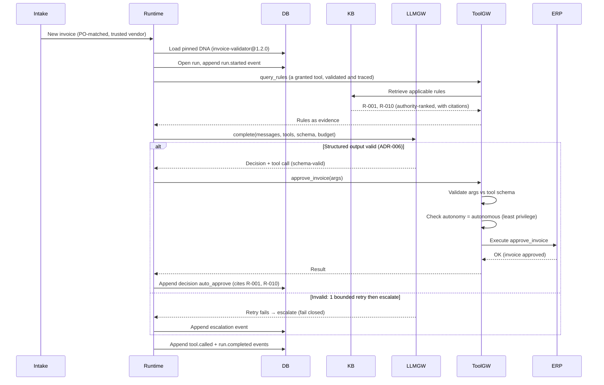
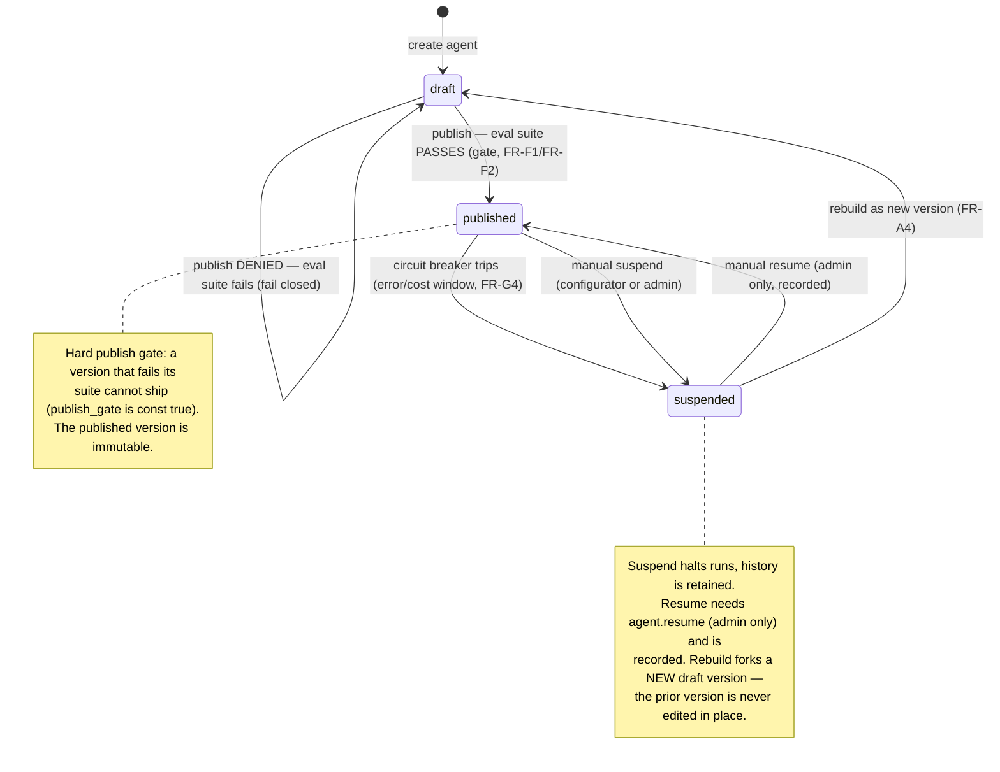

# Forge

**A governed agent factory** — where enterprise AI agents are *configuration artifacts*, not code.

One runtime interprets many agents, and each agent is a declarative JSON document — its "DNA" — that says what it may do, with what, up to what limit, and under whose approval. Governance is not a feature bolted on top but a structural property of the platform: an agent can only ever do what its DNA declares, high-impact actions require a human, every decision cites the rule that allowed it, and nothing reaches production without passing its evaluation suite.

The platform is demonstrated end to end with one realistic vertical — **accounts-payable invoice approval** for a simulated mid-market client, Meridian Supply Co. — because when money moves, the value of governance is obvious.

> Runs fully **offline** with no API key · **247** backend tests · **20/20** evaluation cases · one command from clone to a working system.

---

## The system in two diagrams

**An agent run, end to end.** The runtime loads the *pinned* DNA version, reaches the governed rules through the tool gateway, calls the model through the LLM adapter, and issues a tool call the same gateway validates and executes. Every step is appended to the audit log as it happens.



**An agent version's lifecycle.** Publishing is a hard gate, a published version is immutable, and the only way back from a suspension is a person with a permission the configurator structurally cannot hold.



The structure behind these is a **C4 model** in Structurizr DSL — [`docs/02-architecture/c4/workspace.dsl`](docs/02-architecture/c4/workspace.dsl), narrated in [`architecture-overview.md`](docs/02-architecture/architecture-overview.md). Two more behavioural diagrams cover the [human-in-the-loop approval](docs/02-architecture/diagrams/seq-hitl.md) (approve, reject, and an expiry that cancels) and the [guardrail block](docs/02-architecture/diagrams/seq-guardrail-block.md) (a duplicate, and a case no rule covers). The data model is an ER diagram in [`data-model.md`](docs/02-architecture/data-model.md).

---

## See it in 60 seconds

You need Docker, and nothing else. No API key, no `.env` file, no follow-up commands.

```bash
git clone https://github.com/Roygrh/forge.git
cd forge/deploy
docker compose up -d --build --wait
```

`--wait` returns only when every container reports healthy — and the API's healthcheck *is* its readiness probe, so when your prompt comes back the schema is migrated, Meridian's rules, policies, eval suite and agents are seeded, and there is something published to run. About two to three minutes cold, forty seconds warm.

Then open **<http://localhost:5173>**. You will see four agent cards. On **Invoice Validator**, leave the **Case to run** picker on `1. INV-4401 — clean approval` and press **Run**. In under a second the run reads `Completed`, the decision card says `Auto approve`, and the citations read `R-001` `R-010` — with the fact each rule matched on in the reasoning. Expand **Raw events** at the bottom: that is the append-only log the screen was projected from.

<!-- SCREENSHOT: catalog — the four agent cards at #/, with one card's "Tools granted" column visible: the red `forbidden` pill on meridian-erp-schedule-payment@1.0.0, the amber `requires approval` pill on request-info-from-vendor, and the "Case to run" picker open showing the five labelled beats -->

<!-- SCREENSHOT: beat 1 run trace — status pill "Completed", the green "Auto approve" decision card with citations R-001 R-010, and the six tool steps above it; the reasoning line "match.price_variance_pct lte 2 (actual: '0.80')" should be legible -->

Interactive API docs are at <http://localhost:8000/api/v1/docs>; `curl http://localhost:8000/api/v1/ready` tells you which of the three readiness checks failed, if any. The full ten-minute walkthrough — twice, once for an engineer and once for someone who will never open a terminal, with pre-flight and recovery — is [`docs/demo-script.md`](docs/demo-script.md).

---

## Ten minutes, five beats

The fastest explanation of the whole system. Each row is a **Case to run** option on an agent card, in order. Beats 1, 2, 3 and 5 are the **same agent, same version** — only the facts change.

| # | What runs | What happens | Why it matters |
|---|---|---|---|
| 1 | Invoice Validator · `INV-4401 — clean approval` | `completed` · **auto_approve** citing R-001, R-010 | It works — and it tells you which rules let it. The citation is a rule ID plus the fact it matched on, not a summary. |
| 2 | Invoice Validator · `INV-4409 — $12,000, over policy` | `escalated` · **escalate** citing R-001, R-010, **R-020, R-090** | Same vendor, a *better* match, and it stops: two rules fired with different answers, and the meta-rule R-090 picked the most restrictive. Trust does not beat policy, and the arithmetic is on the record. |
| 3 | Invoice Validator · `INV-4471 — duplicate invoice number` | `escalated` · **block_escalate** citing R-001, R-010, **R-040**, R-090 — and `approve_invoice` is **never called** | The beat that pays for the platform. Five tool steps, no sixth: the write tool was not blocked, it was never asked for. You can prove nothing moved. |
| 4 | Invoice Comms · `INV-4405 — ask the vendor (needs a person)` | `awaiting_approval` — the message is drafted, validated, and **not sent** | Its only tool is granted `requires_approval`, so the run parks. The queue shows the exact action and everything the agent looked at. Approving as the Configurator is a **403** — segregation of duties is enforced by the server. If nobody answers in eight working hours, the request is **cancelled**. |
| 5 | Invoice Validator · `Policy question — which approval threshold governs?` | `completed` · answered per authority, **both conflicts shown** | Three sources disagree ($5,000 in a 2019 PDF, $10,000 in the 2023 one and in the SME-validated rule). Authority decides, the loser is struck through and kept, and a remediation item flags the stale document to its owner. |

<!-- SCREENSHOT: beat 3 run trace — the "Block escalate" decision pill with citation R-040, and the list of five tool steps with no approve-invoice step among them (contrast with beat 1's six) -->

<!-- SCREENSHOT: beat 5 retrieval step — the amber "⚖ SOURCES DISAGREED" banner on approval_threshold, the "resolved by authority (R-090)" pill, the ✓ governed card (R-020, $10,000) beside the superseded card (AP-Policy-2019.pdf#approval-thresholds, $5,000) -->

<!-- SCREENSHOT: approvals queue — the parked comms action with its arguments as labelled fields (channel `phone_on_file` visible), the invoice and the rules in play beneath it, and the countdown to expiry -->

<!-- SCREENSHOT: the 403 — pressing ✓ Approve while "Acting as" reads Configurator: the red permission_denied error naming approval.decide as the required permission -->

<!-- SCREENSHOT: resumed run trace after approval — the executed tool step reading "Released by role:approver — this call ran only because a person approved it" -->

---

## How it works

The backend's nine components are best read as five conceptual layers ([`architecture-overview.md`](docs/02-architecture/architecture-overview.md) walks the same model in more depth).

**1. Definition — what an agent is.** An agent is one JSON document valid against [`dna-schema.json`](docs/02-architecture/dna-schema.json): identity and version, instructions, tool grants with an autonomy level each, knowledge collections, model and budgets, guardrails, and the eval suite it must pass. The registry validates every document at write time and versions it with semver — nothing runs that the schema has not admitted. [`dna-README.md`](docs/02-architecture/dna-README.md) explains the contract, and the four shipped agents are in [`dna-examples/`](docs/02-architecture/dna-examples/).

**2. Runtime — how an agent acts.** A custom reason/act/observe loop ([ADR-003](docs/adr/003-custom-agent-runtime.md)) interprets any valid DNA, enforces `max_steps`, the token and cost ceilings and the timeout, and pauses across human approvals with all state in the database — a paused run resumes by replaying its own event log ([ADR-010](docs/adr/010-resume-by-replay.md)). Every model call goes through one `complete()` contract with provider adapters behind it ([ADR-005](docs/adr/005-llm-adapter-layer.md)), and every model response is schema-validated with exactly one corrective retry before the run escalates ([ADR-006](docs/adr/006-structured-outputs.md)).

**3. Tools and knowledge — what an agent can reach.** The tool gateway is the single, mandatory path from an agent to anything outside it: it validates every call against the tool's typed contract, enforces the DNA's `autonomous` / `requires_approval` / `forbidden` grant, and records the call whether or not it ran. Rule lookup and knowledge retrieval are registered tools too, so what an agent may *read* is a grant like any other. Retrieval is hybrid (pgvector plus Postgres full-text, [ADR-004](docs/adr/004-postgres-single-store.md)) and authority-ranked: `sme_validated` beats `policy_2023` beats `policy_2019`, and conflicts are surfaced, never averaged.

**4. Governance — cross-cutting, not a box.** Fail-closed defaults are `const`-locked in the schema. The approval service holds actions with a server-side deadline that cancels and never approves. The eval runner is the publish gate. The circuit breaker suspends a version on an error or cost threshold, and only a role that cannot configure or publish agents may resume it. And the event store is append-only by database grant *and* trigger ([ADR-008](docs/adr/008-append-only-audit.md)), so every decision is reconstructable from the log alone.

**5. Experience — how people work with it.** A React SPA ([ADR-007](docs/adr/007-frontend-react-vite.md)) with five screens: the agent catalog, one run's trace, the approval queue, the eval suite with its publish gate, and per-agent metrics. Every screen reads what was recorded — the trace viewer is a projection of the event log, the metrics are computed from it at read time — so "the screen shows exactly what happened" is true by construction.

Everything ships as two application images plus PostgreSQL 16 with pgvector, via Docker Compose ([ADR-009](docs/adr/009-docker-compose-deployment.md)). The rationale for each layer is in [`docs/adr/`](docs/adr/) — ten records, each with the alternatives it rejected.

---

## Design principles

Each is a claim, followed by where in the repository the evidence is.

**Agents are configuration, not code.** The four shipped agents differ *only* in their DNA. Intake may read an invoice and nothing else; the validator may approve one up to a ceiling declared in its grant (`{"max_amount_usd": 10000}`, validated against the tool's own config schema) and is *forbidden* to schedule payments; comms may not contact a vendor without a human, so its run stops in `awaiting_approval` with the message drafted and unsent. *Evidence:* [`docs/02-architecture/dna-examples/`](docs/02-architecture/dna-examples/) — four documents, one code path. `invoice-validator-restricted` is the validator with one line changed, shipped so that the platform refusing something is one click away.

**One runtime, N agents.** There is no per-agent code. `src/backend/app/runtime/loop.py` executes whatever valid DNA it is handed, and the LLM adapter behind it is interchangeable — the shipped agents name a deterministic in-process provider, and swapping `"provider": "fake"` for `"anthropic"` is the only change needed to run the same agent against a real model. *Evidence:* three adapters behind one contract in `src/backend/app/llm/adapters/`; `app/runtime/loop.py` imports the contract and the gateway and never an adapter, so the runtime cannot tell which one answered.

**Governance is structural.** `escalate_on_no_rule_match`, `require_citations`, `publish_gate` and `authority_policy: highest_wins` are `const` in the schema — a definition that tries to disable them is not a permissive agent, it is an invalid document that will not load. The `events` table refuses `UPDATE`, `DELETE` and `TRUNCATE` by grant *and* by trigger, because PostgreSQL exempts a table's owner from its own grants. A tool handler is invoked in exactly one place — `ToolGateway._execute` — and a test parses every module under `app/` and fails if a second call site ever appears. No role may both configure an agent and approve its actions: `INCOMPATIBLE_DUTIES` is checked at import time and raises, so a build that violates it does not start. *Evidence:* [`dna-schema.json`](docs/02-architecture/dna-schema.json), `src/backend/alembic/versions/20260729_0001_initial_schema.py`, `tests/test_events_append_only.py`, `tests/test_governance.py`, `src/backend/app/governance.py`.

**Fail closed.** On doubt, missing permission, or a case no rule covers, the platform escalates to a human rather than guessing. Every refusal — a forbidden tool, a blown budget, a step limit, a decision below its confidence floor, an unmatched case — carries a machine-readable reason code, a plain-language explanation, and its own step in the trace. An approval that runs out of time **cancels**; there is no extend operation in the API, and a test asserts that against the served contract rather than trusting the sentence. *Evidence:* `src/backend/app/governance.py` (the reason vocabulary), `tests/test_approvals.py`, and the red banner:

```
⛔ BLOCKED BY THE PLATFORM     permission_denied

The agent asked for a tool its own definition does not permit it to use.
Least privilege is part of the published definition, so the call was
refused and nothing was executed.
```

<!-- SCREENSHOT: the blocked run — press Run on "Invoice Validator (approval revoked)": the red ⛔ BLOCKED BY THE PLATFORM banner with reason code permission_denied, the denied tool step below it, and the governance step that ended the run -->

**Rules are data, not code.** Meridian's tacit rules R-001 … R-092 — captured in SME interviews during discovery — are rows in a `rules` table, each with its statement, its authority, and machine-evaluable conditions. The validator contains none of them; it retrieves them and reasons over what came back. Lower a threshold with one `UPDATE` and the next run decides differently: no code change, no rebuild, no redeploy. *Evidence:* [`docs/01-discovery/04-tacit-rules.md`](docs/01-discovery/04-tacit-rules.md) and `src/backend/app/rules/catalog.py`, kept in lockstep by `tests/test_rules.py`, which parses the markdown and fails on a paraphrased statement. `tests/test_ap_agents.py` lowers a threshold mid-suite and watches the same invoice change outcome.

**Evaluation is the publish gate.** The 20 cases in [`06-eval-cases.md`](docs/01-discovery/06-eval-cases.md) were written before the agents existed. Each executes a real run of the version under test — offline, deterministic — and is scored by programmatic asserts: final action, cited rule IDs, tools called and *not* called, budgets, a reconstructable trace. `POST .../publish` answers **409** until this exact version has a completed, passing run of the suite its own DNA declares, and the passing run is recorded on the version as the publish's evidence. The button on the Evals screen is a courtesy; the 409 is the control. *Evidence:* `python -m scripts.run_evals` (20/20), `python -m scripts.demo_publish_gate` (refused with 409, then green, then published with its evidence), `tests/test_evals.py`.

<!-- SCREENSHOT: the Evals screen after pressing "Run suite" — twenty green rows with expected vs actual per case, and the "Publish gate" panel stating the gate's state in words -->

**The model is a field in the DNA.** Provider, model id, and the token, per-run and per-day cost ceilings are declared per agent and enforced by the adapter layer — the daily ceiling is summed from committed `runs` rows, so it survives a restart and cannot be reset by publishing a new version. The API key lives in exactly one place, the adapter, and never in a definition, a tool, or the browser. *Evidence:* the `model` block of any file in [`dna-examples/`](docs/02-architecture/dna-examples/), `src/backend/app/llm/gateway.py`, `tests/test_governance.py` (the daily-ceiling case).

**And it is measured from the same log it is audited by.** There is no metrics table. Auto-approval rate, escalation rate, block rate by reason code, cost and latency are computed from `events` at read time, so a dashboard figure can never drift from the audit trail. The circuit breaker consumes the same projection. *Evidence:* `src/backend/app/observability/`, `python -m scripts.demo_observability`, `tests/test_observability.py`.

<!-- SCREENSHOT: the Metrics screen — per-agent auto-approval and escalation rates, block rate by reason code, and the cost and latency figures, with the suspend/resume controls visible on one card -->

---

## Repository tour

Read in this order. `docs/` is the source of truth; when code and docs diverge, one of them is fixed explicitly.

| Path | What lives there | Read it for |
|---|---|---|
| [`docs/00-charter.md`](docs/00-charter.md) | Vision, scope, the five frozen decisions, the phase plan and its status | What was decided before anything was built, and why |
| [`docs/01-discovery/`](docs/01-discovery/) | The simulated client, its stakeholders, the interview notes, the captured **tacit rules** (R-xxx), the MoSCoW requirements, and the 20 **eval cases** | The requirements phase — the rules and the cases the whole build is measured against |
| [`docs/02-architecture/`](docs/02-architecture/) | The C4 model, four behavioural diagrams, the data model, the **DNA contract** and examples, and the API contract ([`api/openapi.yaml`](docs/02-architecture/api/openapi.yaml)) | The design, stated before the code |
| [`docs/adr/`](docs/adr/) | Ten architecture decision records in MADR format, amended where reality changed | The judgment: each choice, its alternatives, its trade-offs |
| [`docs/demo-script.md`](docs/demo-script.md) | The ten-minute walkthrough in a technical and a business version, with pre-flight and recovery | How to show it, and what will happen when you do |
| [`docs/PROJECT-STATE.md`](docs/PROJECT-STATE.md) | The handoff: what is built, where each capability lives, the frozen decisions, the operating rules, and how to verify it all | Resuming the project cold |
| [`src/backend/`](src/backend/README.md) | Python 3.12 · FastAPI · SQLAlchemy · PostgreSQL 16 + pgvector — the runtime, both gateways, knowledge, approvals, evals, observability, the API, and 247 tests | The platform itself; its README has the layout and the notes for reviewers |
| [`src/frontend/`](src/frontend/README.md) | React 18 · Vite · TypeScript strict · Tailwind — five screens, no router library, no state library | The operations SPA and how it stays honest about what the API said |
| [`deploy/`](deploy/) | `docker-compose.yml` and a documented `.env.example` | The one-command cold start and every value it reads |

---

## What this is and is not

Forge is small in surface and honest in depth: three business agents (plus one shipped to be refused), one tenant, every architectural layer real. The scope was set in the charter and held. What a production deployment would still need, and why each was scoped out rather than left out:

| Not in this build | What exists instead | Why it was scoped this way |
|---|---|---|
| **An agent-authoring UI.** The catalog reads DNA and publishes, suspends and resumes versions, but does not edit documents. | `POST /agents/{id}/versions` admits a new draft from a DNA document, validated against the schema, and the eval gate stands in front of publishing it. `python -m scripts.demo_publish_gate` walks that path end to end. | A form over the schema is the easy half of FR-A2, and it adds no governance. The hard half — that nothing invalid loads and nothing unevaluated ships — is done and tested. A screen that cannot enforce more than the API already does was left for later, deliberately. |
| **Real authentication.** Roles arrive in an `X-Forge-Role` header and are trusted. | The permission matrix, the 403s, and the audit record of every refused operation are real. Segregation of duties is enforced by the server and asserted by tests. | The charter scoped SSO out on day one. What matters for the thesis is the *matrix* — and it is checked at import time. Swapping the header for a session is the first hardening item and changes nothing about who may do what. |
| **A real ERP.** MeridianERP is simulated in-process, with its own storage and its own ledger of what Forge posted to it. | Seven typed tool contracts, behind the gateway. The agents never talked to an ERP — they talked to the tools. | `app/erp/store.py` becoming an HTTP client is the only change a real integration needs. Keeping the ERP outside the platform's database is what makes the C4 boundary a boundary the code actually has. |
| **Operational multi-tenancy.** One tenant is active. | Every business table carries `tenant_id`; the seed creates one tenant, `meridian-supply-co`, and everything belongs to it. | Structure prepared, operation deferred: the data model is multi-tenant-ready without pretending to be a multi-tenant product. |
| **A public hosted instance (Phase 5.2).** | The one-command local start, verified from a cold volume, and a demo video (still to be recorded). | **Deferred as a decision, not an omission.** A public instance with a trusted role header and env-file secrets would be a liability to keep up for a demonstration whose entire value is *governance*. The local start covers the evaluator's need at a fraction of the risk, and the images already build identically for either. Revisited when real authentication exists, or when an evaluator cannot run Docker. |

Also out of scope, unchanged since the charter: high availability, model fine-tuning, more than one business vertical, production-grade UI polish.

---

## Status

| Phase | | State |
|---|---|---|
| 0 | Planning & charter | ✅ Complete |
| 1 | Discovery & requirements | ✅ Complete |
| 2 | Architecture & contracts | ✅ Complete |
| 3 | Walking skeleton (running platform foundation) | ✅ Complete |
| 4.1 | The accounts-payable domain (ERP, tools, rules as data, three agents) | ✅ Complete |
| 4.2 | Governance in depth (autonomy, fail-closed, limits, SoD, visible blocks) | ✅ Complete |
| 4.3 | Knowledge (authority-ranked retrieval, conflict resolution, citations) | ✅ Complete |
| 4.4 | Human in the loop (approval queue, fail-closed expiry, autonomy report) | ✅ Complete |
| 4.5 | Evaluation suite as publish gate (20 seeded cases, offline runner, hard 409) | ✅ Complete |
| 4.6 | Observability & containment (per-agent metrics from the event log, circuit breaker, manual resume) | ✅ Complete |
| 5.1 | Deployment polish (one-command cold start, liveness/readiness, documented configuration) | ✅ Complete |
| 5.2 | Public hosted instance | ⏸ **Deferred by decision** — the local one-command start and a demo video cover the need without exposing a trusted-header demo to the internet; see [What this is and is not](#what-this-is-and-is-not) |
| 6.1 | Demo packaging (curated story data, 10-minute script in two versions, case picker in the UI) | ✅ Complete |
| 6.2 | The definitive README and repository coherence | ✅ Complete |

Verified at close: `pytest` — 247 passed · `python -m scripts.run_evals` — 20/20 · `ruff`, `mypy`, `tsc --noEmit` — clean · all five demo beats asserted by `tests/test_demo_story.py` on every build.

See [`src/backend/README.md`](src/backend/README.md) for the API, the configuration reference and the test suite, [`src/frontend/README.md`](src/frontend/README.md) for the UI, and [`docs/PROJECT-STATE.md`](docs/PROJECT-STATE.md) to pick the project up cold.
