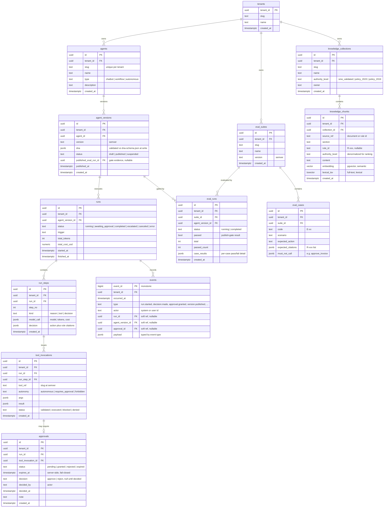

# Data Model

One PostgreSQL 16 store holds everything ([ADR-004](../adr/004-postgres-single-store.md)):
relational tables for platform state, an **append-only `events` table** for audit and
trace ([ADR-008](../adr/008-append-only-audit.md)), and `pgvector` for knowledge
embeddings. Every business table carries `tenant_id` (NFR-4), so the schema is
multi-tenant-ready while a single tenant is active. Agent DNA lives as validated `jsonb`
— the contract is stored whole, never shredded.

## Notes

**Key relationships.** An `agent` is an identity; its behaviour is a series of immutable
`agent_versions`. A `run` is bound to the exact `agent_version` that produced it (FR-A3),
so any historical decision is reproducible against the DNA that made it. `run_steps`
decompose a run into reason/tool/decision steps; `tool_invocations` hang off the step
that issued them and, when the tool's autonomy is `requires_approval`, own exactly one
`approval` (FR-E2). Knowledge is `collections → chunks`; evals are `suites → cases`, with
each `eval_run` scored against one `agent_version`.

**Events are the source of truth.** The `events` table is append-only: the application
role is granted `INSERT`/`SELECT` only — no `UPDATE`, no `DELETE` (ADR-008). Immutability
is a database grant, not a convention. Every state transition and decision is written as
an event in the same transaction as the state-row change, so run state, the approval
queue, and lifecycle history are all **reconstructable from events** (FR-G1, FR-G2). The
soft references (`run_id`, `agent_version_id`, `approval_id`) are nullable because a
single event type only populates the refs it concerns; the relational tables are the
fast read path, events are the audit ground truth.

**Why DNA as `jsonb`, not shredded columns.** The golden rule is that the DNA JSON Schema
is *the* contract and nothing bypasses it. Storing the whole validated document as one
`jsonb` value keeps the database faithful to that contract: the schema — versioned in
[`dna-schema.json`](./dna-schema.json) — is the single authority on structure, validated
at write time before the row is accepted. Shredding DNA into columns would fork the
contract into a second, drifting definition and would couple every schema evolution to a
migration. `jsonb` also lets us index into the document (e.g. `dna->'model'->>'provider'`)
without pretending the relational schema owns the shape. The tradeoff is that structural
guarantees come from application-side validation plus a `CHECK`, not from column types —
acceptable because the schema is the deliberate single source of structure.

**Knowledge: authority + hybrid search.** Each `knowledge_chunk` carries an
`authority_level` (denormalized from its collection so ranking is a local read) plus both
an `embedding` (pgvector, semantic) and a `lexical_tsv` (Postgres full-text, lexical).
Retrieval combines the two — exact terms like vendor names and invoice numbers must hit
(FR-D3) — and the authority hierarchy (`sme_validated` > `policy_2023` > `policy_2019`)
orders conflicting sources so they are surfaced, never averaged (FR-D2). `rule_id` lets a
chunk be cited by ID (R-xxx) to satisfy `require_citations` (R-092, FR-D4).

## Open questions

- **Per-case eval results as `jsonb` vs a dedicated table.** `eval_runs.case_results`
  holds per-case pass/fail inline. This is enough for the publish gate (a single `passed`
  boolean) but is not relationally queryable — which matters if FR-F4 ("failed production
  runs exportable as new eval cases") grows into per-case trend analytics. Splitting an
  `eval_case_results` table is deferred until that read pattern is real, not invented now.
