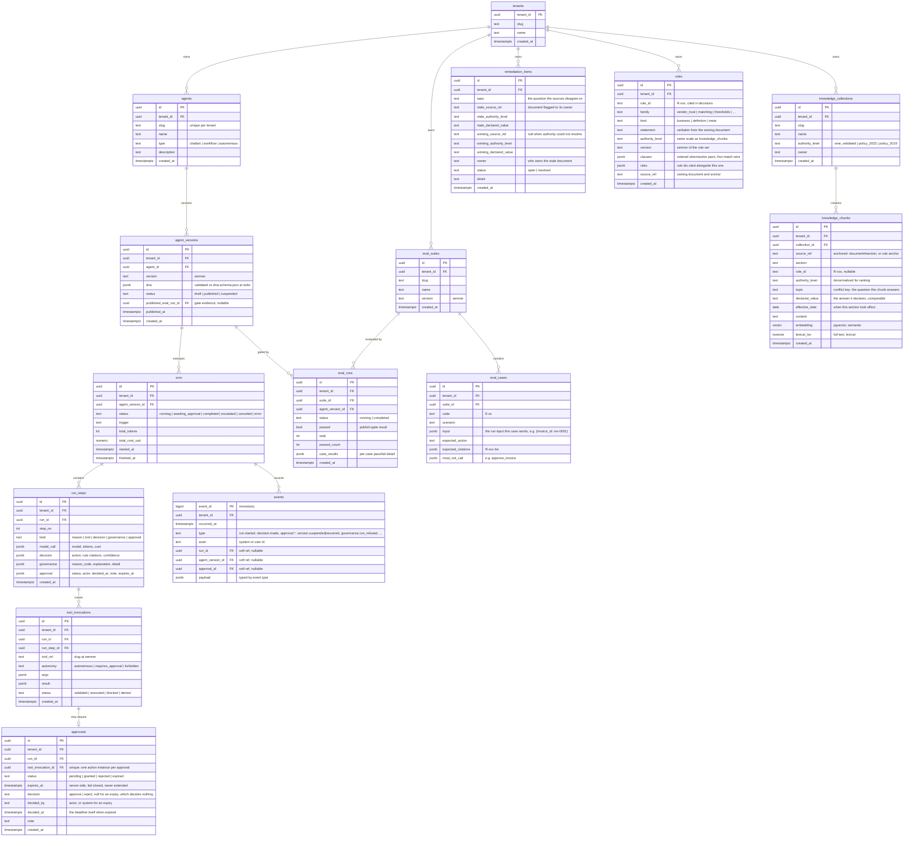

# Data Model

One PostgreSQL 16 store holds everything ([ADR-004](../adr/004-postgres-single-store.md)):
relational tables for platform state, an **append-only `events` table** for audit and
trace ([ADR-008](../adr/008-append-only-audit.md)), and `pgvector` for knowledge
embeddings. Every business table carries `tenant_id` (NFR-4), so the schema is
multi-tenant-ready while a single tenant is active. Agent DNA lives as validated `jsonb`
— the contract is stored whole, never shredded.

## Notes

**Key relationships.** An `agent` is an identity; its behaviour is a series of immutable
`agent_versions`. A `run` is bound to the exact `agent_version` that produced it (FR-A3),
so any historical decision is reproducible against the DNA that made it. `run_steps`
decompose a run into reason/tool/decision steps; `tool_invocations` hang off the step
that issued them and, when the tool's autonomy is `requires_approval`, own exactly one
`approval` (FR-E2). Knowledge is `collections → chunks`; evals are `suites → cases`, with
each `eval_run` scored against one `agent_version`.

**A refusal is a step, not a footnote.** When the platform stops a run — a tool the DNA
does not grant, a blown budget, a decision below its confidence floor — it writes a
`run_steps` row of kind `governance` carrying the machine-readable `reason_code`, the
plain-language explanation that goes with it, and the circumstance that triggered it.
The reason codes are defined once (`app/governance.py`) and used unchanged by the
runtime, the audit log, the API, and the UI. A run carries one per stop, and it always
says why (FR-C5) — normally exactly one, since a stopped run is over. The exception is
the one state a run comes *back* from: a run that paused for a human approval records
`approval_required` when it parked and, if it stops again, the code that ended it — an
`approval_rejected`, an `approval_expired`, or whatever the resumed loop hit. Refusals
that never became a run — an operation denied to a role that lacked its permission — are
events without a `run_id`.

**A human's decision is a step too.** `run_steps.kind = 'approval'` records the parked
action's deadline and the approve / reject / expire that answered it, with the actor and
the timestamp (FR-E4). A person deciding has a position in the run's order and is what
happened next, so it belongs beside the model's steps and the platform's rather than only
in a side table. The step carries the tool ref and the exact arguments being decided,
which is what makes the log answer *what was authorised* without a join — and what stops
a later change to the `tool_invocations` row from rewriting what somebody approved.

**`awaiting_approval` is the one non-terminal stop.** Every other way a run ends is
final. A parked action leaves the run waiting on the `approvals` row written in the same
transaction as the `tool.called` event that parked it, and the run leaves that state in
exactly three ways: `granted` resumes it (the released call goes back through the same
tool gateway, and the run continues to a terminal state of its own), while `rejected` and
`expired` cancel it. **Expiry cancels; it never approves** — `expires_at` is written once
from the agent's `guardrails.approval_sla_seconds`, compared against the server's clock,
and moved by nothing: there is no extend operation in the API, in the queue, or in this
schema (FR-E3). A resumed run is recorded by a second `TraceRecorder` that reads its step
counter and its spend back from the run's own rows, so `max_steps` and the budget keep
meaning "per run" across the pause.

**Events are the source of truth.** The `events` table is append-only: the application
role is granted `INSERT`/`SELECT` only — no `UPDATE`, no `DELETE` (ADR-008). Immutability
is a database grant, not a convention. Every state transition and decision is written as
an event in the same transaction as the state-row change, so run state, the approval
queue, and lifecycle history are all **reconstructable from events** (FR-G1, FR-G2). The
soft references (`run_id`, `agent_version_id`, `approval_id`) are nullable because a
single event type only populates the refs it concerns; the relational tables are the
fast read path, events are the audit ground truth.

**Metrics are projections, and containment is events (FR-G3, FR-G4).** There is
deliberately **no metrics table** in this schema. The per-agent numbers the dashboard
shows — runs, auto-approval rate, escalation rate, block rate by reason code, average
cost/tokens/latency — are computed from `events` at read time
(`app/observability/metrics.py`), so a dashboard figure is always recomputable from the
audit trail and can never drift from it. The circuit breaker consumes the same
projection over a trailing window; when it trips, the `agent_versions.status` change to
`suspended` and its `version.suspended` event (carrying the tripping numbers) are
written in one transaction, and every start refused while suspended is itself a
`governance.run_refused` event. *Why* an agent is suspended is not a column anywhere —
it is the recorded event, which nothing can edit. The way back is `version.resumed`,
written only by a person holding `agent.resume` (a permission structurally incompatible
with configuring or publishing, NFR-5 applied to containment).

**Why DNA as `jsonb`, not shredded columns.** The golden rule is that the DNA JSON Schema
is *the* contract and nothing bypasses it. Storing the whole validated document as one
`jsonb` value keeps the database faithful to that contract: the schema — versioned in
[`dna-schema.json`](./dna-schema.json) — is the single authority on structure, validated
at write time before the row is accepted. Shredding DNA into columns would fork the
contract into a second, drifting definition and would couple every schema evolution to a
migration. `jsonb` also lets us index into the document (e.g. `dna->'model'->>'provider'`)
without pretending the relational schema owns the shape. The tradeoff is that structural
guarantees come from application-side validation plus a `CHECK`, not from column types —
acceptable because the schema is the deliberate single source of structure.

**Rules are rows, not code.** The captured tacit rules
([`04-tacit-rules.md`](../01-discovery/04-tacit-rules.md)) live in `rules`: each carries
its citable `rule_id`, the `statement` its owner signed off, an `authority_level`, and
`clauses` — an ordered list of machine-evaluable `when`/`action` pairs, first match wins.
The invoice-validator agent contains none of them; it retrieves them through the tool
gateway and reasons over what it retrieved, citing the ids it applied (R-092). Because
the rule set is read from this table on every run, **changing a rule is an `UPDATE`** —
no code change, no rebuild, no redeploy. `clauses` is `jsonb` for the same reason DNA is:
the condition grammar is owned by a schema (`app/rules/model.py`), and shredding a
condition tree into columns would fork that definition. This is the *structured* half of
the knowledge layer — exact lookups and evaluable thresholds; `knowledge_chunks` below is
the semantic half, and both carry `authority_level` on the same scale so a rule and a
policy document can be ranked against each other (FR-D2, R-090).

Meridian's own data — vendors, purchase orders, goods receipts, invoices — is
deliberately **absent** from this schema. MeridianERP is an external system in the C4
model; a vendor master is the client's state, not the platform's. It is simulated in
`app/erp/` with its own storage, so the boundary the architecture claims is a boundary
the code actually has.

**Knowledge: authority + hybrid search.** Each `knowledge_chunk` carries an
`authority_level` (denormalized from its collection so ranking is a local read) plus both
an `embedding` (pgvector, semantic) and a `lexical_tsv` (Postgres full-text, lexical).
Retrieval combines the two — exact terms like vendor names and invoice numbers must hit
(FR-D3) — and the authority hierarchy (`sme_validated` > `policy_2023` > `policy_2019`)
orders conflicting sources so they are surfaced, never averaged (FR-D2). `rule_id` lets a
chunk be cited by ID (R-xxx) to satisfy `require_citations` (R-092, FR-D4); a document
chunk is cited by its anchored `source_ref` (`AP-Policy-2023.pdf#approval-thresholds`),
which resolves back to the chunk a human can open — the same citation model for both.
The `embedding` column is deliberately dimensionless: the width belongs to the embedding
provider (`app/knowledge/embeddings.py` — a deterministic, offline hashing embedder by
default, a learned model by configuration), and at this corpus size retrieval is a
sequential scan, so no ANN index forces the choice early.

**Conflicts are data, and so is their remediation.** `topic` and `declared_value` are
the conflict-detection key: two retrieved chunks that share a `topic` but declare
different values are the same question answered differently. Retrieval resolves the pair
by authority (R-090) — the loser is *marked superseded, never dropped* — or, when the
authorities are equal, resolves nothing and the run fails closed (R-091,
`knowledge_conflict`). Either way the conflict writes a `remediation_items` row flagging
the stale document to its owner (FR-D5): a record, not a workflow, deduplicated per
(topic, stale document, winner) so repeated retrievals do not re-flag the same fact.

**Evals are cases → runs, and the gate reads the run.** An `eval_case` carries
everything needed to *execute* it, not just describe it: the exact `input` the runner
sends (an invoice id from the seeded ERP, or E-19's policy question), the expected
action, the citations that must appear, and the tools that must not. A suite run
(`app/evals/runner.py`) starts one real `runs` row per case — trigger `eval`, scored
from the run's own append-only events, against a private per-case ERP so the demo's
state is never disturbed — and records the verdict in `eval_runs.passed`. That boolean
is what `POST /agents/{id}/versions/{version}/publish` demands (FR-F2): a completed,
passing eval run for exactly this version and exactly the suite its DNA declares, with
the winning run kept on `agent_versions.published_eval_run_id` as the gate's evidence.
The seed script's directly-published demo versions are the one documented exception,
visible by that column being null.

## Open questions

- **Per-case eval results as `jsonb` vs a dedicated table.** `eval_runs.case_results`
  holds per-case pass/fail inline. This is enough for the publish gate (a single `passed`
  boolean) but is not relationally queryable — which matters if FR-F4 ("failed production
  runs exportable as new eval cases") grows into per-case trend analytics. Splitting an
  `eval_case_results` table is deferred until that read pattern is real, not invented now.
