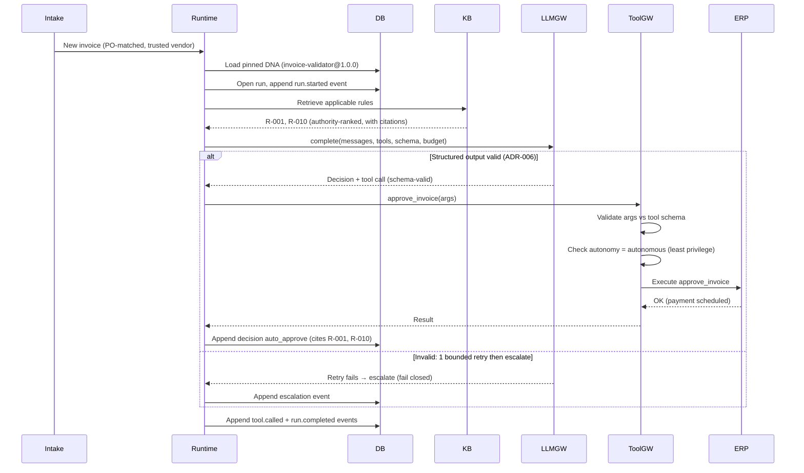

# Sequence — Agent run (happy path, end to end)

The routine invoice path: an invoice arrives, the runtime loads the **pinned** DNA
version, assembles authority-ranked knowledge, calls the model through the LLM gateway
(structured output, one bounded retry then escalate), then issues an `auto_approve`
tool call that the tool gateway validates and executes. Every model call, tool call,
rule, and decision is appended to the event log as it happens. This is E-01/E-02 shape.

## What to notice

- **DNA is pinned per run** — the run loads `invoice-validator@1.0.0`; a historical run
  always references the exact version that produced it (FR-A3, DNA versioning).
- **Knowledge is authority-ranked and cited** — KB returns rule IDs with citations, so
  the decision can satisfy `require_citations` (R-092).
- **One bounded retry, then escalate** — the `else` branch is ADR-006's fail-closed
  rule: malformed output never becomes an action; it becomes a human escalation.
- **The tool gateway is the only path to ERP** — args are schema-validated and the
  per-tool autonomy level is checked before execution (FR-C1, FR-C2, FR-C3).
- **Everything is an event** — model call, tool call, decision, and completion are all
  appended (never updated), making the run reconstructable (ADR-008, FR-G1).
