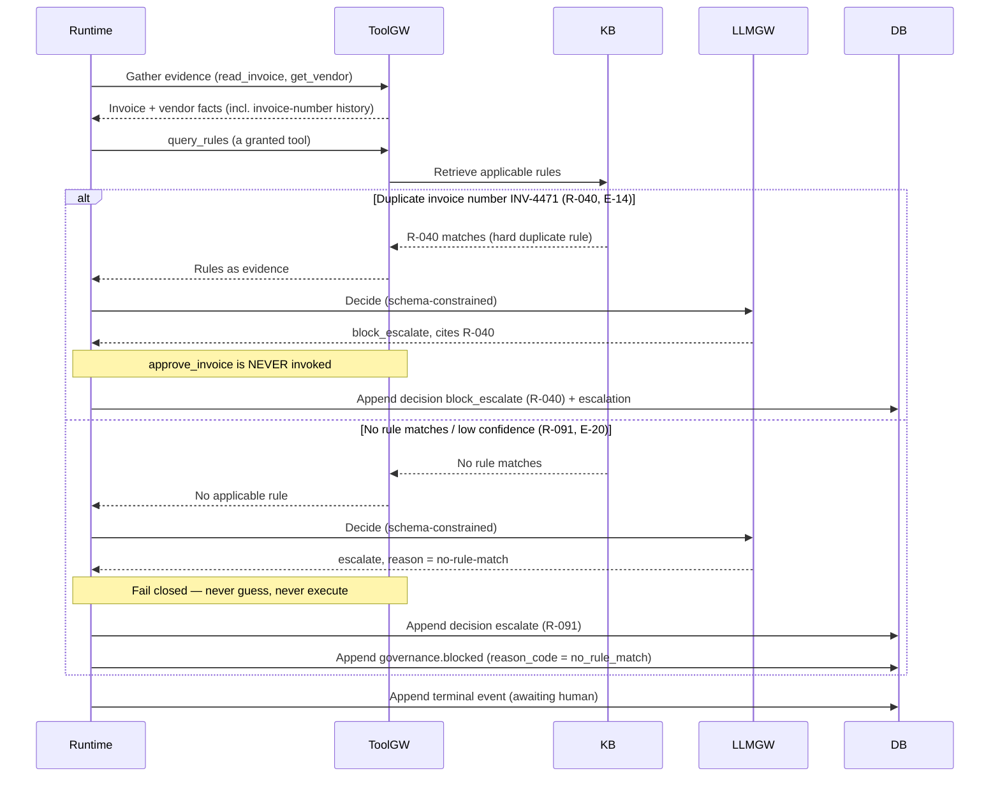

# Sequence — Guardrail block (duplicate & no-rule-match)

Two fail-closed outcomes, side by side. A duplicate invoice number is a **hard rule**
(R-040 → `block_escalate`, case E-14): the run stops and `approve_invoice` is never
called. An invoice matching **no rule** at low confidence (R-091 → `escalate`, case
E-20) is the same doctrine from the other direction: never guess, never execute. In
both, no money-moving tool is invoked and the decision cites the rule that fired.

## What to notice

- **Hard rule stops the run** — R-040 is `block_escalate`: the decision is a full stop
  plus human escalation, not a queued action (tacit rules, duplicates & fraud guards).
- **`approve_invoice` never fires (E-14 assert)** — the note over Runtime/ToolGW marks
  the exact invariant the eval case asserts: the money-moving tool is not called.
- **No-rule-match is not "figure it out"** — the `else` branch is R-091 / ADR-006's
  fail-closed default: absence of a matching rule forces `escalate`, with the reasoning
  stating no-rule-match (E-20).
- **The decision still cites a rule** — even a block or a no-match cites R-040 / R-091,
  so `require_citations` (R-092) holds for guardrail outcomes too.
- **Both outcomes are traced** — the block and the escalation are appended events,
  reconstructable like any other run (ADR-008, FR-G1).
- **A platform refusal adds a governance step** (Phase 4.2) — when the *platform* stops a
  run rather than the agent deciding, it appends a `governance.blocked` event carrying a
  machine-readable `reason_code`, the plain-language explanation, and the circumstance.
  The no-rule-match branch above is one of them (`no_rule_match`); a tool the DNA forbids
  is another (`permission_denied`). The full vocabulary is `app/governance.py`, and a run
  carries at most one: the platform stops once, and it always says why.
