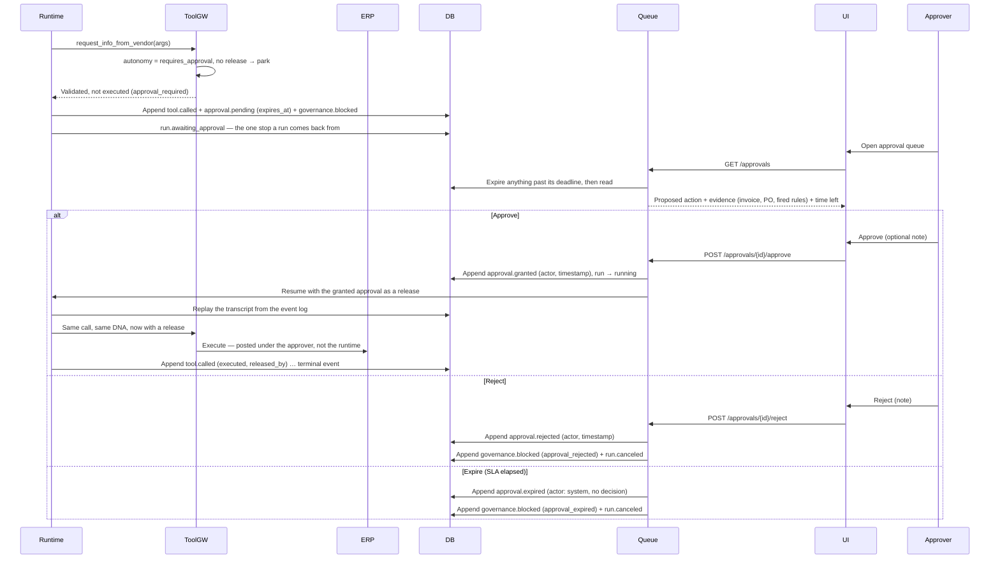

# Sequence — Human-in-the-loop approval

When the runtime wants an action whose DNA autonomy is `requires_approval`, the tool
gateway refuses to execute and the runtime persists a pending approval and pauses the
run. An approver decides in the UI. Three outcomes — **approve** (resume and execute),
**reject** (cancel), and **expire** (cancel on SLA timeout) — and the crucial invariant:
expiry cancels; it never auto-approves. Every branch writes an event.

## What to notice

- **The gateway holds, it does not execute** — `requires_approval` autonomy means the
  action is enqueued, never run, until a human decides (FR-C3, FR-E2).
- **Granular approval** — one pending record covers exactly one action instance with
  its parameters; the approver sees the evidence beside it (FR-E1, FR-E2). The resume
  replays *that record's* stored arguments, and the approve request carries none of its
  own, so there is no shape of request that approves one action and runs another.
- **Expiry cancels, never approves** — the third branch is the fail-closed invariant
  from CLAUDE.md golden rule 3 and FR-E3: an expiring approval is a cancellation. The
  deadline is written once when the action parks, compared against the *server's* clock,
  and moved by nothing — there is no extend operation in the API to draw here.
- **Actor and timestamp on every decision** — approve/reject/expire are all recorded
  with who and when (FR-E4), as append-only events (ADR-008). An expiry is recorded
  against `system` with no `decision`, because it is the absence of one.
- **No execution without recorded approval** — only the Approve branch reaches ERP,
  satisfying the cross-cutting assert that money-moving tools need a human OK. And the
  approval is written `granted` *before* the action runs, so a crash between the two
  leaves a recorded approval and an unexecuted action rather than the reverse.
- **The resume goes back through the gateway** — it is the same enforcement point, the
  same published DNA, and every other check applies again, so an approval granted while
  a grant was being revoked cannot run the revoked tool. What a release adds is one piece
  of evidence, not a second path to a tool ([ADR-010](../../adr/010-resume-by-replay.md)).
