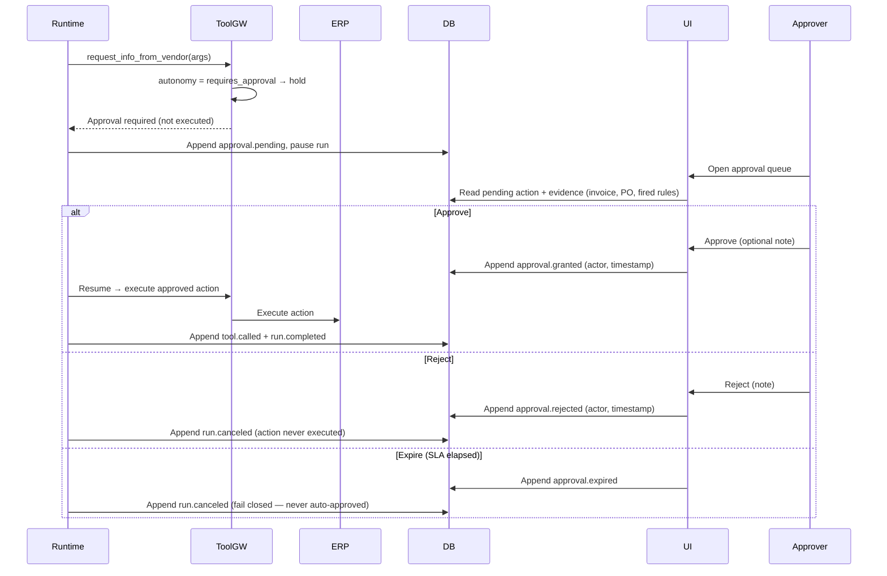

# Sequence — Human-in-the-loop approval

When the runtime wants an action whose DNA autonomy is `requires_approval`, the tool
gateway refuses to execute and the runtime persists a pending approval and pauses the
run. An approver decides in the UI. Three outcomes — **approve** (resume and execute),
**reject** (cancel), and **expire** (cancel on SLA timeout) — and the crucial invariant:
expiry cancels; it never auto-approves. Every branch writes an event.

## What to notice

- **The gateway holds, it does not execute** — `requires_approval` autonomy means the
  action is enqueued, never run, until a human decides (FR-C3, FR-E2).
- **Granular approval** — one pending record covers exactly one action instance with
  its parameters; the approver sees the evidence beside it (FR-E1, FR-E2).
- **Expiry cancels, never approves** — the third branch is the fail-closed invariant
  from CLAUDE.md golden rule 3 and FR-E3: an expiring approval is a cancellation.
- **Actor and timestamp on every decision** — approve/reject/expire are all recorded
  with who and when (FR-E4), as append-only events (ADR-008).
- **No execution without recorded approval** — only the Approve branch reaches ERP,
  satisfying the cross-cutting assert that money-moving tools need a human OK.
