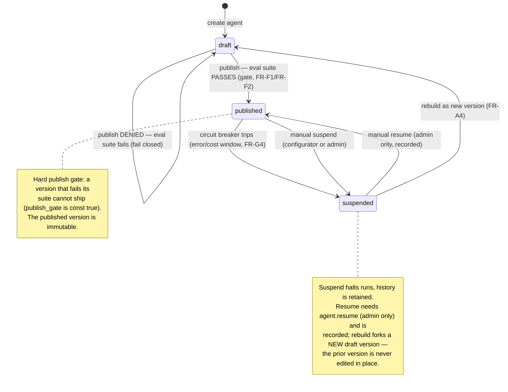

# State — Agent version lifecycle

An agent version moves through a small, governed lifecycle: **draft** (editable),
**published** (live — reachable only by passing the eval suite), and **suspended**
(halted by the circuit breaker or an admin). Publishing is a hard gate, and a
published version is immutable — the way "back" is to **rebuild** a new draft version.
Each transition below is labelled with its trigger.

## What to notice

- **Publishing is eval-gated, and the gate cannot be turned off** — `draft → published`
  requires the suite to pass (FR-F1/FR-F2); the self-loop `publish DENIED` shows a
  failing suite keeps the version in draft. `publish_gate` is a `const true` in the DNA
  schema, so no definition can bypass it.
- **Versions are immutable; change means a new version** — the `edit` and `rebuild`
  self/return transitions always produce a *new* draft (semver bump), never mutate a
  published one (FR-A3, DNA versioning philosophy).
- **Two independent suspend triggers** — automatic (circuit breaker on error/cost,
  FR-G4) and manual (`agent.suspend`, held by configurator and admin). Both halt runs
  while retaining history, and both are recorded as `version.suspended` events.
- **Two ways back, for two different problems** — `suspended → published` is a manual
  **resume**, held only by the admin role and structurally denied to whoever configures
  or publishes agents (NFR-5 applied to containment): the version already passed its
  eval gate, and what tripped was an operational threshold, not the definition. When
  the definition itself is at fault, the way back is **rebuild**: `suspended → draft`
  forks a new version through the eval gate (Jeff's "start/stop/destroy/rebuild",
  FR-A4). A suspended version is never edited in place, and nothing resumes by itself.
- **Transitions are events** — each state change is an appended lifecycle event, so the
  agent's history is itself reconstructable from the log (ADR-008).
